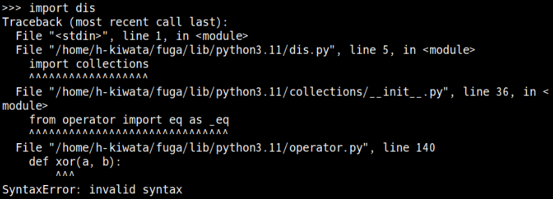
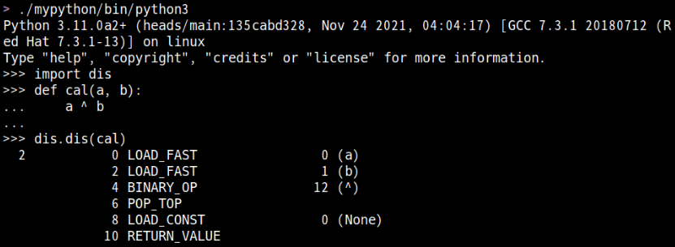

## 概要

- CPython のソースコードリーディングを行い、言語拡張やデータ構造がどのように C 言語で実装されているかを調査する。今回の調査で使用している Python は `Python 3.11.0a2+` である。

## 調査ログ

### 2021/11/16

- 初期設定とプログラムのビルドを行う。ディレクトリは git から落としてきた `cpython` ディレクトリで行う。`-g` オプションで実行ファイルにデバッグシンボルを埋め込む。そして、`-O0` オプションで最適化度合いを最低に落とす。こうすると、GDB などのデバッガでデバッグの情報を読み出すことができる。また、`--prefix` オプションでインストールするフォルダを指定する。

```bash
cd oss/
git clone https://github.com/python/cpython.git
cd cpython

CFLAGS="-O0 -g" ./configure --with-pydebug --prefix=/home/h-kiwata/fuga
make -j $(nproc)
make install
```

- `${HOME}/fuga/bin/python3 main.py` でビルドしたバイナリで Python のファイルを実行することができる。ちなみに、`main.py` の中身は以下である。

```python
a = 1000
a += 20
print('Hello World')
```

- GDB のよく使うオプション
  - `run`
  - `step (s)`
  - `next (n)`
  - `delete (d)`
  - `i b`
  - `continue`
  - `until`

#### 参考

- [Python Developer’s Guide](https://devguide.python.org/)
- [Changing CPython’s Grammar](https://devguide.python.org/grammar/)

---

### 2021/11/17

- token のオブジェクトの中身を見てみる。

- `cpython/Parser/pegen.c` 内の `_PyPegen_run_parser_from_file_pointer` 内で token のオブジェクトの生成が完了している。この関数の中で字句解析された各 token を確認する。

```cpp
...
_PyPegen_run_parser_from_file_pointer(FILE *fp, int start_rule, PyObject *filename_ob,
                             const char *enc, const char *ps1, const char *ps2,
                             PyCompilerFlags *flags, int *errcode, PyArena *arena)
{
    struct tok_state *tok = _PyTokenizer_FromFile(fp, enc, ps1, ps2);
...
    char *start, *end;
    while (1) {
        int tok_type = _PyTokenizer_Get(tok, &start, &end);
        printf("token %s\n", _PyParser_TokenNames[tok_type]);
        if (tok_type == ENDMARKER) {
            break;
        }
    }
}
```

- こういう調査は興味があり手を動かし続けられれば、ある程度理解することができる。その先に何かしらのパッチを投げられるのではないかと思った。

---

### 2021/11/18

- 特に何もしなかった。

---

### 2021/11/19

- ファイルからプログラムを実行すると、`Parser/pegen.c` 内の `_PyPegen_run_parser_from_file_pointer` が呼び出される。この内部ではすでに字句解析されたオブジェクト `struct tok_state *tok` が生成されている。この関数の中に以下のロジックを埋め込むと、分割された文字列が確認できる。

```cpp
struct tok_state *tok = _PyTokenizer_FromFile(fp, enc, ps1, ps2);
if (tok == NULL) {
...
char *start, *end;
while (1) {
    int tok_type = _PyTokenizer_Get(tok, &start, &end);
    printf("type %s, name %.*s\n", _PyParser_TokenNames[tok_type], tok->cur - tok->start, tok->start);
    if (tok_type == ENDMARKER) {
        break;
    }
}
```

- このプログラムを埋め込んで `${HOME}/test/bin/python3 main.py` を実行すると、以下のように字句解析されたトークンとそのタイプを確認できる。

```bash
type NAME, name a
type EQUAL, name =
type NUMBER, name 1000
type NEWLINE, name

type NAME, name a
type PLUSEQUAL, name +=
type NUMBER, name 20
type NEWLINE, name

type NAME, name print
type LPAR, name (
type STRING, name 'Hello World'
type RPAR, name )
type NEWLINE, name 

type ENDMARKER, name
```

- 従って、`_PyTokenizer_FromFile` 内で字句解析が行われていると推測できる。この時点で自分はファイルポインタが生成される実装とどのように token オブジェクトが生成されているかに興味を持った。

- ファイルポインタ `FILE *fp` の生成には `Modules/main.c` 内の `pymain_run_file_obj` 関数内の `_Py_fopen_obj` 関数で行われている。使われ方は以下である。この関数内でプラットフォームに応じたファイルを開く処理が行われており、`fopen` が呼び出されている。

```cpp
FILE *fp = _Py_fopen_obj(filename, "rb");
```

- この `FILE fp*` を用いてファイルの中身を読み出し、字句解析する実装がどこかにあるはずである。

- 途中で `make install` が実行できなくて困った。

- `Python.h` を使って検証プログラムを書こうと思ったが、インクルードの仕方がわからず諦めた。

- `python -m dis` で Python バイトコードの逆アセンブラを確認することができる。

#### 参考

- [printfで文字列の最大文字数を指定する](https://iww.hateblo.jp/entry/20090701/printf)
- [dis --- Python バイトコードの逆アセンブラ](https://docs.python.org/ja/3/library/dis.html)

---

### 2021/11/20

- `Parser/pegen.c` の `_PyPegen_run_parser_from_file_pointer` を読むと、`Parser/pegen.c` の `_PyPegen_run_parser` がポイントだと感じた。そのため、その関数を読むと、`_PyPegen_parse` の理解が必要だと感じた。そこで、`Parser/parser.c` の `_PyPegen_parse` を読もうと思った。しかし、`Parser/parser.c` は `./Grammar/python.gram` から自動で生成されるファイルなので、一旦読むのを諦めて、言語自体を拡張する方にシフトすることにした。

- 文法を拡張する。機能としては以下が挙げられる。
  - `&&`, `||`, `!` の追加
  - `else if` の追加

- 新しく token や PEG を変更すると以下のコマンドを叩く必要がある。

```bash
make regen-token
make regen-pegen
make -j $(nproc) && make install
```

- しかし、使用している環境 (Amazon Linux 2) のデフォルトの Python のバージョンが古いため、`make regen-pegen` を実行することができない。そこで `pyenv` を用いてグローバル環境に Python 3.7 以降の環境を作成してから `make regen-pegen` を実行することにした。`pyenv` のインストールには [pyenv/pyenv](https://github.com/pyenv/pyenv#installation) を参考にする。Qiita の記事は今回使用している環境との相性が悪かった。
- `pyenv` をインストール後、自前でビルドしている Python のバージョンと合わせようと思い、`pyenv install 3.11.0a2+` を実行しようとした。しかし、`openssl` 関連のライブラリをインストール必要があった。この依存関係の解決が面倒臭かったので、`Python 3.8.0` を使用することにしてその場しのぎの解決策を講じた。

```bash
pyenv install --list
pyent install 3.8.0
pyenv global 3.8.0
```

- 以下のようにグローバルにインストールされた Python のバージョンを確認した。

```bash
> python --version
Python 3.8.0 
```

- こうして Python のバージョンを変更すると、`make regen-pegen` を実行することができ、Python の文法を拡張することができた。拡張できたかどうかは以下のようにインタラクティブシェルで確認した。


#### 参考

- [PythonにC言語っぽい文法を追加する](https://doss2020-3.hatenablog.com/entry/2020/10/25/155612)
- [pyenv/pyenv](https://github.com/pyenv/pyenv#installation)
- [pyenv global が効かなくなった（？）話](https://blog.serverworks.co.jp/2021/05/12/233520)

---

### 2021/11/21

- 文法を拡張する。機能としては以下が挙げられる。
  - `unless 文` の追加
  - インタープリタでエンターを押すと、自動でインデントが付くように修正する。
    - GDB の共有ライブラリ内の実装にまで追えず途中で諦めた。

```bash
make regen-pegen
make regen-ast
make -j $(nproc) && make install
```

- `unless` を追加した結果の処理の確認は以下のようになる。


#### 参考

- [Pythonにunless文を追加する](https://doss2020-3.hatenablog.com/entry/2020/10/25/160454)
  - この記事に書いてあることだけを実装しても動かなかった。しかし、基本的なことは大変参考になった。

---
- [大規模ソフトウェアを手探る](https://doss.eidos.ic.i.u-tokyo.ac.jp/)
- [東京大学eeic3年後期実験「大規模ソフトウェアを手探る」2016年度まとめ](https://pf-siedler.hatenablog.com/entry/2017/02/07/101831)
- [東京大学eeic3年後期実験「大規模ソフトウェアを手探る」2015年度まとめ](https://swimath2.hatenablog.com/entry/2015/12/03/172000)
- [CPythonに機能追加してみた（ビルド&構造把握）](https://qiita.com/takashi-o/items/d557033179e8d879ac31)
- [Pythonを改造してみた はじめに](https://doss2020-3.hatenablog.com/entry/2020/10/25/155352)
- [Pythonをいじっていろんな機能を追加してみた](https://py-plu-thon.hatenablog.com/entry/2020/10/31/154051)
- [Pythonを改造してみた unless文を追加してみた]()
  - 今回自分がビルドしているバージョンとは違うので、ほとんど参考にしていない。

---

### 2021/11/22

- 文法を拡張する。機能としては以下が挙げられる。 
  - `xor 演算子` の追加
  - `mod 演算子` の追加

- これまでやってきたように `Grammar/python.gram` に `xor 演算子` 用の PEG を追加する。

- diff は以下である。

```bash
@@ -713,6 +744,7 @@ bitwise_or[expr_ty]:

 bitwise_xor[expr_ty]:
     | a=bitwise_xor '^' b=bitwise_and { _PyAST_BinOp(a, BitXor, b, EXTRA) }
+    | a=bitwise_xor 'xor' b=bitwise_and { _PyAST_BinOp(a, BitXor, b, EXTRA) }
     | bitwise_and
```

- そして、以下のコマンドを実行する。

```bash
make regen-pegen
make -j $(nproc) && make install
```

- 次に、`mod 演算子` を追加しようとした。しかし、これまで通り `Grammar/python.gram` に `mod 演算子` 用の PEG を追加したところ、以下のようなエラーが生じた。これは、他のライブラリ内のブログラムで `mod 変数` を使っているため定義することはできないようである。そのため、今回の実装は一旦見送ることにした。

```bash
Programs/_freeze_module importlib._bootstrap ./Lib/importlib/_bootstrap.py ./Python/frozen_modules/importlib._bootstrap.h
Programs/_freeze_module importlib._bootstrap_external ./Lib/importlib/_bootstrap_external.py ./Python/frozen_modules/importlib._bootstrap_external.h
Programs/_freeze_module zipimport ./Lib/zipimport.py ./Python/frozen_modules/zipimport.h
Programs/_freeze_module abc ./Lib/abc.py ./Python/frozen_modules/abc.h
  File "<frozen zipimport>", line 285
    mod = sys.modules.get(fullname)
    ^^^                                                       
SyntaxError: invalid syntax
make: *** [Python/frozen_modules/zipimport.h] エラー 1
make: *** 未完了のジョブを待っています....
```

#### 参考

- [Pythonを改造してみた はじめに](https://pf-siedler.hatenablog.com/entry/2016/11/01/231816)

---

### 2021/11/23

- 昨日に拡張した文法である `xor 演算子` について再度考える。`xor 演算子` を使用した後に、インタラクティブシェルで `import` 周りの操作を行うと、以下のようなエラーが生じてしまう。これは、`operator` モジュールに `xor` 関数があるため、名前が競合しているからと考えられる。そのため、現状の実装では問題がある。
  - 昨日はこれで問題が無いと思ったが甘かった。テストが難しいと思った ...

<!-- - 新しく定義した xor 演算子を使用後に import の命令を書くとエラーが生じる -->


- これは演算子名を `exor` に変更することで回避した。

- 次に、Docker を使って xor を含むプログラムをディスアセンブルした結果と自前でビルドしたプログラムのディスアセンブルした結果を比較してみた。
  - ディスアセンブルした結果が異なる。原因が不明だが、簡単な処理は正常に動作している。そもそも違っていても問題が無いのかすらわからなかった。

- Docker 内の `Python 3.11.0a2` で `^` や `and` のバイトコードを確認した結果が以下である。


- EC2 上で自前でビルドした `Python 3.11.0a2+` で `^` や `and` のバイトコードを確認した結果が以下である。


- この二つの結果より `and` のバイトコードは一致するが、`xor` のバイトコードは一致しないことがわかる。前者では `xor` の演算に `BINARY_XOR` が使用されているが、後者では `BINARY_OP` が使われている違いがあった。`Grammar/python.gram` と `Parser/Python.asdl` より自前でビルドした結果は正しい気もするが、如何せんどういう違いがあるかわからず次に進むことにした。

- ちなみに、まっさらの状況の `cpython` のコードを clone してきてビルドして確認したところ、修正を加えたプログラムを自前でビルドした結果と同じになった。問題なく実装ができてる気もしてきた。



- ディスアセンブルしたマシンコードから追加したロジックが正常かどうかを判定するのは諦めた。そこで、流石にこれぐらい大きい OSS のプロジェクトだとテストコードが書かれてると思い、`CPython` のテスト方法を調査してみた。流れは以下である。
  - `Makefile` の中身を確認し、`make test` でテストを実行できることを確認した。
  - `make test` で実行されるプログラムが `Tools/scripts/run_tests.py` にあることを確認する。確認方法は後に記述する。
  - `Makefile` があるディレクトリで `./python Tools/scripts/run_tests.py` を実行する。そうすると、ログに各ロジック毎に実行されるテストコードのログが流れるので、そこから `Lib/test/test_bool.py` が実行されているようである。`Lib/test/` 配下には `test_` から始まるファイルが大量にあるので、おそらく Python の実行ファイルに対するテストコードがまとめられていると考えられる。(_※ドキュメントなどで要確認_)

- ちなみに `Makefile` の解析は以下のように行った。`Makefile` の中でテストを実行する際のエントリーポイントとなりそうな以下である。


# Executable suffix (.exe on Windows and Mac OS X)
EXE=		
BUILDEXE=	
...
BUILDPYTHON=	python$(BUILDEXE)
...
TESTPYTHON=	$(RUNSHARED) ./$(BUILDPYTHON) $(TESTPYTHONOPTS)
TESTRUNNER=	$(TESTPYTHON) $(srcdir)/Tools/scripts/run_tests.py
...
test:		all platform
		$(TESTRUNNER) $(TESTOPTS)


- 新しく Makefile 内にデバッグ用のターゲット `karin` を追加した。これで `make コマンド` 実行時の各変数を標準出力に表示させるようにした。


karin:
	@echo Karin
	@echo $(BUILDPYTHON)
	@echo $(TESTPYTHON)
	@echo $(TESTRUNNER)


- 実際にデバッグ用に仕込んだコマンドを実行した。そうすると、実際にどのようにしてテストが実行されるのかを確認できた。


h-kiwata cpython [main]
> make karin
Karin
python
./python
./python ./Tools/scripts/run_tests.py


- このテストコードが実装される際の流れや匙加減が気になった。
- 言語を拡張することは文法にも詳しくなれることでもあるが、それが結構楽しいと思った！

#### 参考

- [Pythonを改造してみた 排他的論理のブール演算子作った](https://pf-siedler.hatenablog.com/entry/2016/11/05/135007)
  - 正直なんでここまでの実装をする必要があるかがわからなかった。Python のバージョンのせいなのだろうか？
- [operator --- 関数形式の標準演算子](https://docs.python.org/ja/3/library/operator.html)
- [docker/python](https://hub.docker.com/_/python)
- [Python の or と and 演算子の罠](https://qiita.com/keisuke-nakata/items/e0598b2c13807f102469)
  - Python 内での `if x or y:` はどうなるだろうか？Python では、if の条件式は勝手に真理値が判別されます。つまり、`if bool(x or y):` と同じことが勝手に行われています。
  - このロジックの調査を今度行いたい。

---

### 2021/11/24

- 特になし。

### 2021/11/25

- 特になし。

### 2021/11/26

- 特になし。

### 2021/11/27

- 🤞


<!-- #### 参考

- []() -->
