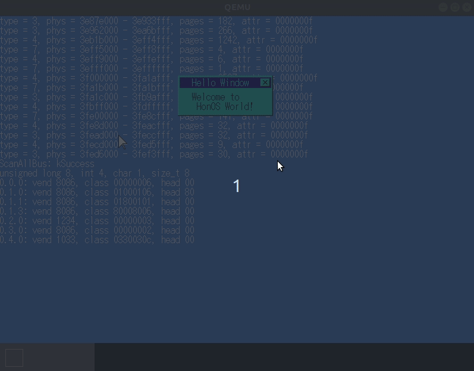
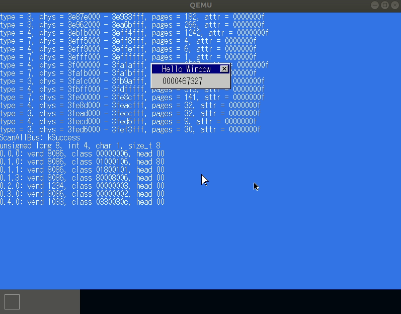
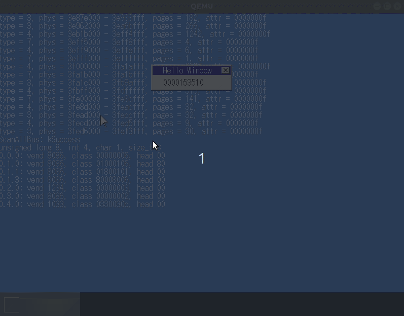

## 概要

- こんにちは！最近、研究室の隣の同期に影響されて自作 OS を始めました。そこで、今回は自作 OS が成長していく様子を日記としてこの記事に残したいと思います。

## 日記




### 2021 年 8 月 13 日



#### 

- 自作 OS を始めました！名前は HonOS です！






### 2021 年 8 月 28 日

#### osbook_day09b


#### osbook_day09c


#### osbook_day09d


### 2021 年 8 月 29 日

#### osbook_day09e


#### osbook_day10a


#### osbook_day10b-invalid

- `FrameBuffer::Copy` の実装が間違っていたせいで表示がバグってしまいました。状況を切り分けつつバグを調査する過程が最高に楽しかったです。


#### osbook_day10b

- ウィンドウを表示することができました！



#### osbook_day10c

- Kernel の main 関数の for ループ回数を書き込んだウィンドウを表示することができました！


### 2021 年 8 月 30 日

- しかし、この記事を見た同期に表示されている色の挙動がおかしいと指摘されました。そこで、[osbook_day10c](https://github.com/uchan-nos/mikanos/tree/osbook_day10c) に checkout し、正常系の挙動を確認してみました。そうすると、確かに正常系と比較すると、挙動がおかしかったので、バグを調査し修正しました。原因は `constexpr PixelColor ToColor(uint32_t c);` の色のビットシフトが逆になっていたことでした。だいぶ画面がチカチカしていますが、そのリファクタリングは次節以降でできればと思っています！


### 2021 年 8 月 31 日

#### osbook_day10d



#### osbook_day10e

- この節では、バックバッファに描画を行った後に、バックバッファをフレームバッファに転送を行います。こうして転送を行うことで、マウスカーソルが表示されない期間を完全になくし、カウンタにマウスを重ねた時のチラツキをなくすことができます。


##### 参考

- [ゼロからOS自作入門 10章](https://zenn.dev/link/comments/85cef9483586e5)
- [【OpenGLでゲームを作る】ダブルバッファリングとは](https://nn-hokuson.hatenablog.com/entry/2014/01/15/164232)
- [ダブルバッファリング 【double buffering】 ](https://e-words.jp/w/%E3%83%80%E3%83%96%E3%83%AB%E3%83%90%E3%83%83%E3%83%95%E3%82%A1%E3%83%AA%E3%83%B3%E3%82%B0.html)
- [描画処理について](http://codebock.web.fc2.com/sec02_03.html)

#### osbook_day10f

- USB ドライバからデータを取り出すプログラムは、マウスのボタンが押されたかとマウスがどれだけ移動したかの変位を取得できる機能のものでした。しかし、なぜかドライバから Kernel にそれらのデータが渡されませんでした。`make clean` や `rm kernel.elf` を実行し、クリアな状況にしても状況が改善されませんでした。そこで、`Makefile` を本家からコピーすると正常な動きをするようになりましたが、なぜデータが Kernel 側に受け渡されなかったかの原因が不明のまま解決してしまいました。



#### osbook_day10g


### 2021 年 9 月 1 日

#### osbook_day11a

- main 関数のリファクタリングを行いました。main 関数が大きすぎて大変でした。見た目の挙動は osbook_day10g と変わりません。


#### osbook_day11b

- 周期的に割り込むタイマを実装しました。一定のカウントが刻まれると、割り込みが入り、背景に文字列が表示されます。


#### osbook_day11c

- 前節よりも短い周期で割り込みを行わせ、その割り込み回数を計算します。


### 2021 年 9 月 2 日

#### osbook_day11d

- 複数のタイマを作成し、それらからのタイムアウト通知を受け取ることができるように修正しました。


#### osbook_day11e

- Kernel で Root System Description Pointer を取得できるように修正しました。これは、後々 IO ポート番号を求めるのに役立ちます。


#### osbook_day12a

- IO ポート番号を求めるのに必要な FADT というテーブルのデータを取得する実装を行いました。UI に変化はありません。


### 2021 年 9 月 3 日

#### osbook_day12b

- ACPI PM タイマ (基準となる軸で、fadt->pm_tmr_blk から求められる。) を使用して Local APIC タイマの 1 カウントが何秒なのかを計測します。


#### osbook_day12c


#### osbook_day12d


#### osbook_day12e


#### osbook_day12f


### 2021 年 9 月 4 日

#### osbook_day13a

- 協調的マルチタスクの機能を実装しました！


#### osbook_day13b

- プリミティブなプリエンプティブマルチタスクの機能を実装しました！特にコンテキストスイッチの自動化を行いました。


#### osbook_day13c

- マルチタスクが実装できるかを検証しました。Hello Window と TaskB Window のカウンタが 1 秒おきに切り替わっていることがわかります。しかし、カウンタは 2 秒間分のカウントを刻んでいます。


#### osbook_day13d

- マルチタスクを管理するための TaskManager を実装しました。タスクを増やせば増やすほどマウスがカクつく問題が生じたので、次章以降で修正していきたいと思います！


### 2021 年 9 月 5 日

#### osbook_day14a

- ランキューを作成して実行可能状態にあるタスクを保持する。処理が完了したタスクをランキューから取り出し Sleep させ、CPU が割り当てられないような機能を実装する。この節では、キーボードからの入力でタスクを Sleep させるか Wakeup させるかを適宜切り替える。


#### osbook_day14b


#### osbook_day14c


#### osbook_day14d


### 2021 年 9 月 6 日

#### osbook_day15a

- ウィンドウの描画をメインスレッドで行うようにリファクタリングを行いました！これまでは TaskB とメインタスクの両方で画面の再描画を行っていました。しかし、それが原因でデータをの競合が発生し、ウィンドウを動かすと、そのゴミが残ってしまっていました。


#### osbook_day15b

- ウィンドウにアクティブ/非アクティブの機能を追加しました！


- この節通りにプログラムを実装すると、実行後すぐに TaskB のウィンドウが消えてしまいます。状況を切り分けてトラブルシューティングすると、main.cpp 内でマウスを初期化する前に Taskb のウィンドウを初期化してしまうことが原因でした。自力で解決できたときは最高に嬉しかったです。その後、念の為、サポートページを確認すると、issues ([osbook_day15b で実行後すぐにTaskBウィンドウが消える](https://github.com/uchan-nos/os-from-zero/issues/42)) の中で同様の質問をしている方がいらっしゃいました。解決方法が正しかったと確信を持ててよかったです。


### 2021 年 9 月 9 日

#### osbook_day15c

- ターミナルウィンドウの UI だけを作成しました！


#### osbook_day15d

- ウィンドウの描画の高速化を行いました！


### 2021 年 9 月 10 日

#### osbook_day16a

- ターミナルに文字列を書き込めるようにしました！


### 2021 年 9 月 11 日

#### osbook_day16b

- `echo コマンド` を実装しました！


#### osbook_day16c

- `clear コマンド` を実装しました！


#### osbook_day16d

- `lspci コマンド` を実装しました！


#### osbook_day16e

- 上矢印/下矢印でコマンドの履歴を遡れるようになりました！


#### osbook_day16f

- CPU のリソースを食いまくっている TaskB のウィンドウを削除しました。以下の top コマンドの差を見ると、削除した結果 QEMU が使用しているリソースが減っていることがわかると思います。

- TaskB を削除する前の top コマンドの結果です。


- TaskB を削除した後の top コマンドの結果です。


- TaskB を削除しただけなので、特に変化はありません！


### 2021 年 9 月 14 日

#### osbook_day17a


### 2021 年 9 月 15 日

#### osbook_day17b


### 2021 年 9 月 16 日

#### osbook_day18a


#### osbook_day18b

- 初めてアプリケーションを自作 OS 上で動作させた。ターミナルに `onlyhlt` コマンドを実行すると、ターミナルのプロセスが止まる。この節で OS とアプリケーションを全てビルドし、OS からアプリケーションを実行できるようなシェルスクリプトを実装した。


### 2021 年 9 月 17 日

#### osbook_day18c

- この節では簡単な算術演算のコマンド `rpn` コマンドを追加で実装した。実装後、OS を起動させると、`rpn` コマンドが実行できない。また、`ls` コマンドも実行できないことにも気づいた。そのため、このバグをトラブルシューティングする必要があった。そこで、まずこの節で追加で実装した機能にバグが無いかを調査した。そして次に、そこにバグが無いことを確認した。これは、`git bisect` のようなやり方でどのタイミングで `ls` コマンドが正常な起動をしなくなったかを調査した。結論としては、アプリケーションを起動させる際に新たに使用するようになった `~/osbook/devenv/make_mikanos_image.sh` の中身の環境変数のパスを自分の OS 用に変更していなかったことが問題だった。変更点は以下である。書籍でも少し触れてくれても良いのではないかと思った。

```bash
---
# LOADER_EFI="$HOME/edk2/Build/MikanLoaderX64/DEBUG_CLANG38/X64/Loader.efi"
# KERNEL_ELF="$MIKANOS_DIR/kernel/kernel.elf"
+++
LOADER_EFI=$HOME/edk2/Build/HonoLoaderX64/DEBUG_CLANG38/X64/Loader.efi
KERNEL_ELF=$HOME/honOS/kernel/kernel.elf
```

- こういったバグをできるだけ素早く気づき、どのケースでバグが発生しているかを確認するためにも、やはりテストコードを書くことは極めて重要だと痛感した。

- また、この節で初めて気づいたのだが、日本語配列のキーボードで `+` を入力すると、`:` が出力されてしまう。色々なキーボードを押して確認していると、`+` を出力するためには、`shift + ^` を押さなければならない。


#### osbook_day18d


### 2021 年 9 月 18 日

#### osbook_day19a

- この章の仮想アドレスと物理アドレスの変換のロジックの実装が難しすぎて泣いた。


### 2021 年 9 月 19 日

#### osbook_day20a

- アプリケーション (rpn) から Kernel の関数 (printk など) を呼び出しました。


### 2021 年 9 月 20 日

#### osbook_day20b


#### osbook_day20c


#### osbook_day20d


### 2021 年 9 月 24 日

#### osbook_day20e

- やっとシステムコールを実装できました。感激です。ここまで来るとシステムプログラミングを下側の Kernel から見上げれます。


### 2021 年 9 月 25 日

#### osbook_day21a

- IST を設定した。


#### osbook_day21b

- `rpn コマンド` で引き算した結果をターミナルに出力するためのシステムコールを実装した。だいぶ身近な箇所の実装にまで辿り着いてさらに楽しくなってきた。


### 2021 年 9 月 26 日

#### osbook_day21c

- 終了のシステムコールを実装しました！この実装により、`rpn` コマンドで足し算や引き算をした結果を出力し、制御をターミナルに戻すことができます。


- 今回は、解説されているプログラムをアプリケーション側から写経していきました。つまり、`apps/rpn/rpn.cpp` の `main 関数` 内で `SyscallExit` を呼び出すことから実装を始めました。これは、前節ではアセンブリから実装を始めたので、視点を変えたかったためです。

- この節を実装して特に感じたことがあります。それは、節によっては説明が前後するため、紹介されているプログラムを読んで直後の解説を読んでもわけがわからないときが多々あることです。自分は紹介されているプログラムが自分で理解できる時は、プログラムを読んで自分なりの解釈を作ってから直後に書かれている解説を読むようにしています。しかし、プログラムを読んでなぜこの実装にしたのかの意図が全くわからず、直後の解説を読んでも特に触れられていない時があります。その時は、その実装の解釈に対してめちゃくちゃ悩み、妥協して読み進めるしかありません。そして、読み進めると、後の方のページでそのプログラムに対する解説を見つけると、何やねんと思ったりすることもありました。紙面や解説の都合上こうなるのはしょうがないと思うのですが、おいってなります。そのため、自分のこの本の読み方を改めつつ、もっと多くの知識を付けたいと思いました。


### 2021 年 9 月 27 日

#### osbook_day21d

- アプリケーションが増えてきたので、アプリケーションのリファクタリングを行いました。UI に特に変更はありません。


#### osbook_day21e

- ウィンドウを開くシステムコールを実装しました。




#### 

- 前節で実装したシステムコールに機能を加え、開いたウィンドウに文字を表示させました。




### 2021 年 9 月 28 日



#### 

- `exit システムコール` を実装しました。これまで `SyscallExit` と記述していた実装を `exit` に書き換えて C の標準ライブラリを使うように修正しました。しかし、以下のように `_exit` が定義されていないというエラ−が出ます。そこで、エラーログに書かれているように `apps/newlib_support.c` に `_exit` を定義し、諸々の修正を行いました。その結果、最終的にはライブラリ関数の `exit` を呼び出すことでアプリケーションを終了させることができました。

```bash
clang++     -I/home/h-kiwata/osbook/devenv/x86_64-elf/include/c++/v1 -I/home/h-kiwata/osbook/devenv/x86_64-elf/include -I/home/h-kiwata/osbook/devenv/x86_64-elf/include/freetype2     -I/home/h-kiwata/edk2/MdePkg/Include -I/home/h-kiwata/edk2/MdePkg/Include/X64     -nostdlibinc -D__ELF__ -D_LDBL_EQ_DBL -D_GNU_SOURCE -D_POSIX_TIMERS     -DEFIAPI='__attribute__((ms_abi))' -I. -O2 -Wall -g --target=x86_64-elf -ffreestanding -mcmodel=large -fno-exceptions -fno-rtti -std=c++17 -c rpn.cpp -o rpn.o
ld.lld -L/home/h-kiwata/osbook/devenv/x86_64-elf/lib --entry main -z norelro --image-base 0xffff800000000000 --static -o rpn rpn.o ../syscall.o ../newlib_support.o -lc -lc++ -lc++abi
ld.lld: error: undefined symbol: _exit
>>> referenced by exit.c
>>>               lib_a-exit.o:(exit) in archive /home/h-kiwata/osbook/devenv/x86_64-elf/lib/libc.a
../Makefile.elfapp:12: recipe for target 'rpn' failed
make[1]: *** [rpn] Error 1
make[1]: ディレクトリ '/home/h-kiwata/honOS/apps/rpn' から出ます
Makefile:3: recipe for target 'build' failed
make: *** [build] Error 2
```





#### 

- 星が描画されたウィンドウを出すアプリケーションを実装しました。





#### 

- タイマカウントを取得するためのシステムコールを追加しました。。





#### 

- 画面の描画の最適化を行いました。gif からもわかるように前節と比較して描画時間が高速になりました。




### 2021 年 9 月 29 日



#### 

- `lines` アプリケーションを実装しました。点をブロットして線を表現しているのですが、 gif の上の方は、傾きが大きくなるほど点の間隔が広くなり上手く描画できていません。それに改善を加えたのが下の方の gif です。下の gif では傾きが急になっても点と点の間隔が広くないような工夫を施しています。











#### 

- アプリケーションのウィンドウを閉じるロジックを追加しました。現時点ではアプリケーションを開くとすぐに終了してしまいます。次節でコマンドでアプリケーションを終了できるように修正します。





#### 

- `Ctrl + Q` でアプリケーションを閉じる機能を追加しました。これでアプリケーションを閉じることができます！



### 2021 年 9 月 30 日

#### osbook_day23a

- 実装中🤞

## 参考

- [honOS](https://github.com/dilmnqvovpnmlib/honOS)
- [mikanos](https://github.com/uchan-nos/mikanos)
