## 概要

- こんにちは！前回に引き続き自作 OS 日記を付けたいと思います。このエントリでは 11 ~ 20 章までの記録を残したいと思います。

## 日記




### 2021 年 9 月 1 日

#### osbook_day11a

- main 関数のリファクタリングを行いました。main 関数が大きすぎて大変でした。見た目の挙動は osbook_day10g と変わりません。


#### osbook_day11b

- 周期的に割り込むタイマを実装しました。一定のカウントが刻まれると、割り込みが入り、背景に文字列が表示されます。


#### osbook_day11c

- 前節よりも短い周期で割り込みを行わせ、その割り込み回数を計算します。

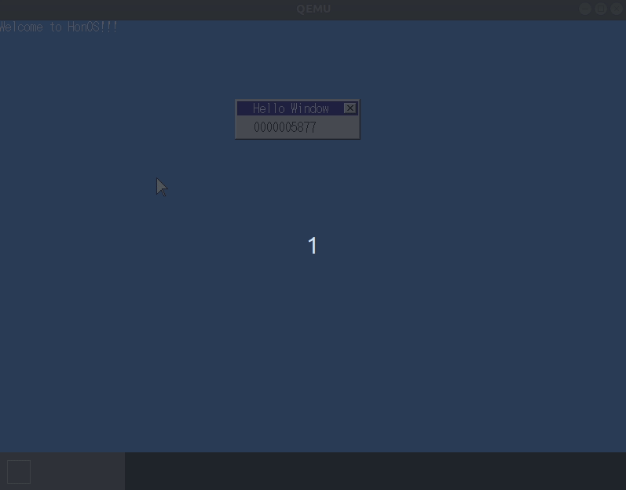


### 2021 年 9 月 2 日

#### osbook_day11d

- 複数のタイマを作成し、それらからのタイムアウト通知を受け取ることができるように修正しました。


#### osbook_day11e

- Kernel で Root System Description Pointer を取得できるように修正しました。これは、後々 IO ポート番号を求めるのに役立ちます。

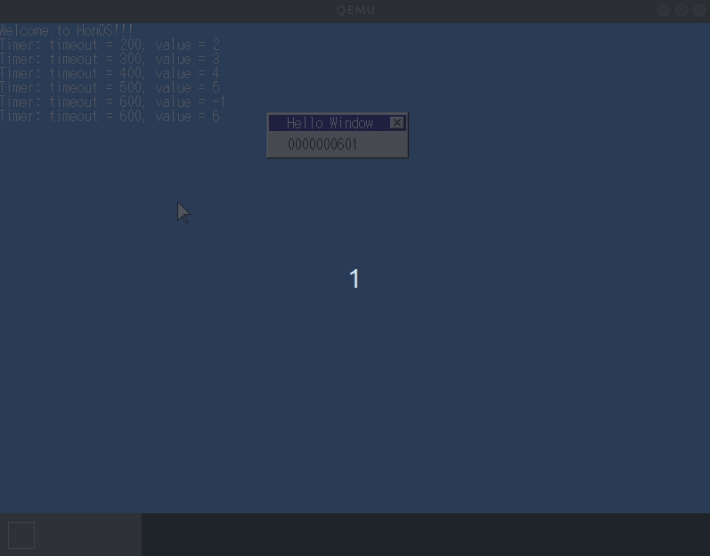

#### osbook_day12a

- IO ポート番号を求めるのに必要な FADT というテーブルのデータを取得する実装を行いました。UI に変化はありません。


### 2021 年 9 月 3 日

#### osbook_day12b

- ACPI PM タイマ (基準となる軸で、fadt->pm_tmr_blk から求められる。) を使用して Local APIC タイマの 1 カウントが何秒なのかを計測します。

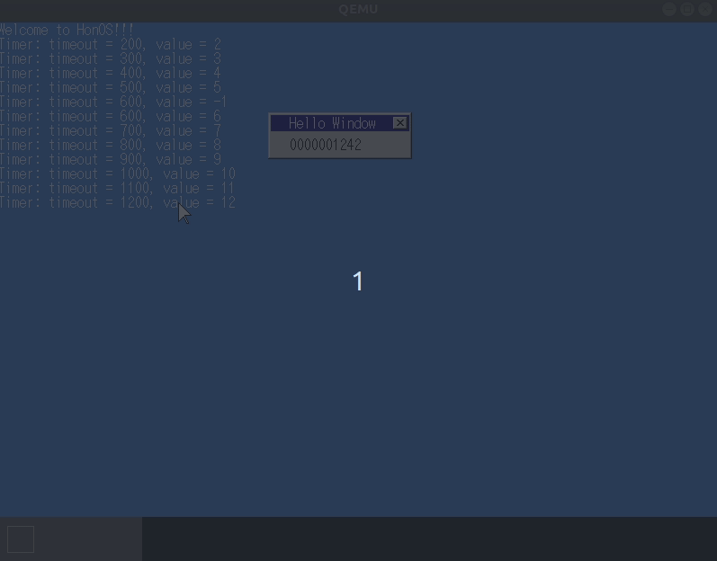

#### osbook_day12c

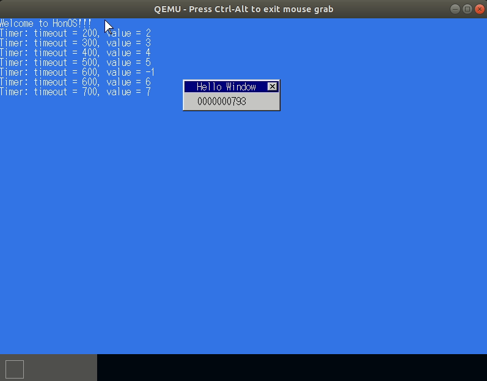

#### osbook_day12d


#### osbook_day12e


#### osbook_day12f


### 2021 年 9 月 4 日

#### osbook_day13a

- 協調的マルチタスクの機能を実装しました！


#### osbook_day13b

- プリミティブなプリエンプティブマルチタスクの機能を実装しました！特にコンテキストスイッチの自動化を行いました。


#### osbook_day13c

- マルチタスクが実装できるかを検証しました。Hello Window と TaskB Window のカウンタが 1 秒おきに切り替わっていることがわかります。しかし、カウンタは 2 秒間分のカウントを刻んでいます。

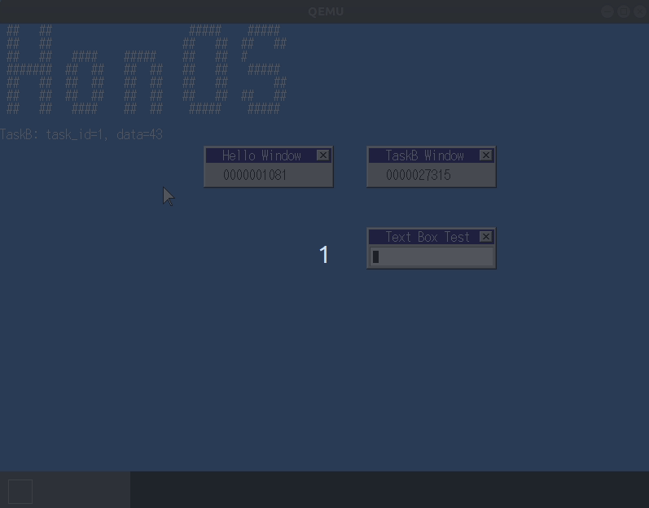

#### osbook_day13d

- マルチタスクを管理するための TaskManager を実装しました。タスクを増やせば増やすほどマウスがカクつく問題が生じたので、次章以降で修正していきたいと思います！

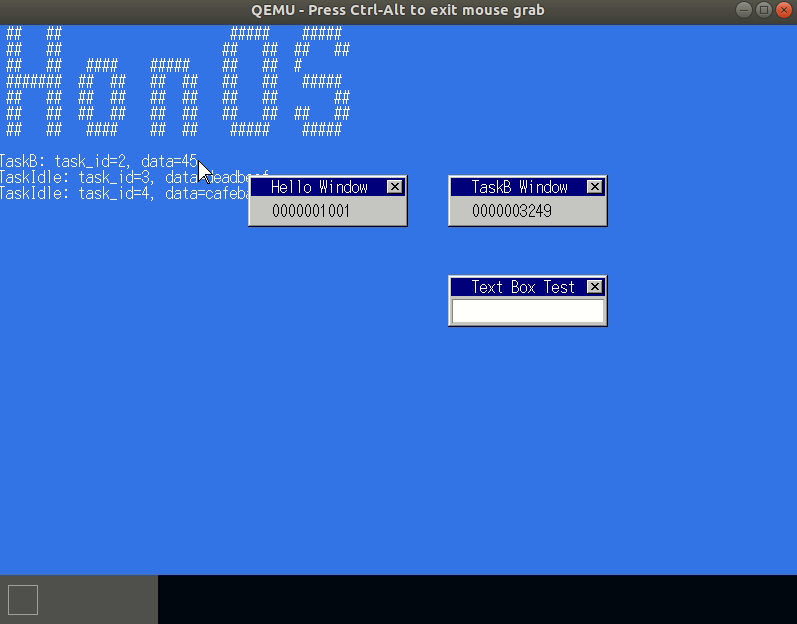


### 2021 年 9 月 5 日

#### osbook_day14a

- ランキューを作成して実行可能状態にあるタスクを保持する。処理が完了したタスクをランキューから取り出し Sleep させ、CPU が割り当てられないような機能を実装する。この節では、キーボードからの入力でタスクを Sleep させるか Wakeup させるかを適宜切り替える。

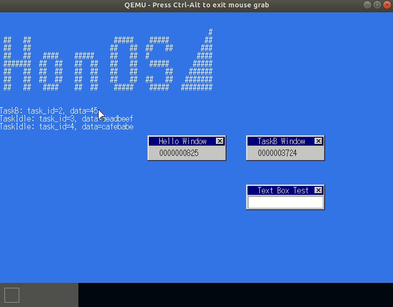

#### osbook_day14b

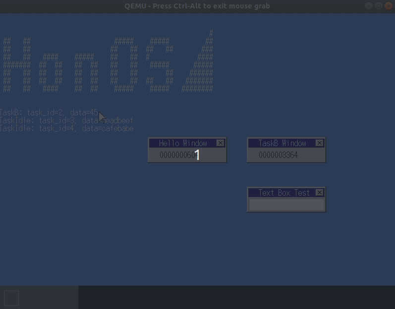

#### osbook_day14c

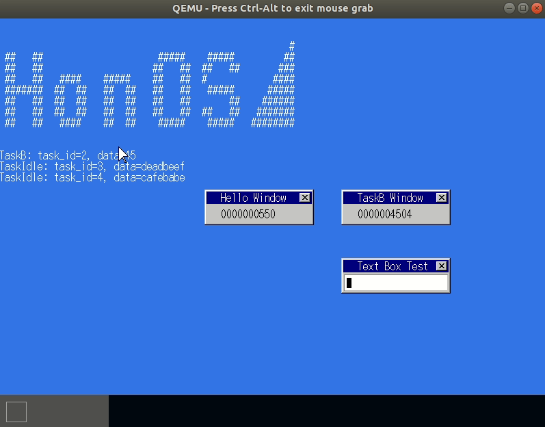

#### osbook_day14d

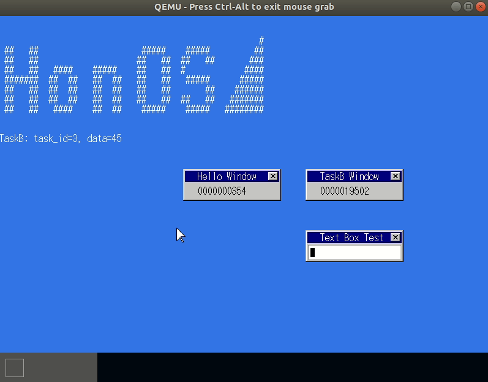


### 2021 年 9 月 6 日

#### osbook_day15a

- ウィンドウの描画をメインスレッドで行うようにリファクタリングを行いました！これまでは TaskB とメインタスクの両方で画面の再描画を行っていました。しかし、それが原因でデータをの競合が発生し、ウィンドウを動かすと、そのゴミが残ってしまっていました。


#### osbook_day15b

- ウィンドウにアクティブ/非アクティブの機能を追加しました！

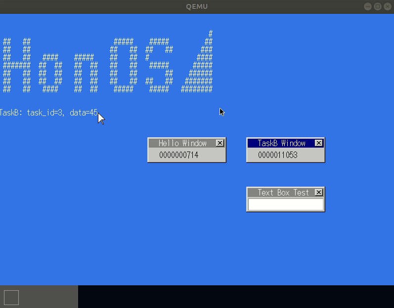

- この節通りにプログラムを実装すると、実行後すぐに TaskB のウィンドウが消えてしまいます。状況を切り分けてトラブルシューティングすると、main.cpp 内でマウスを初期化する前に Taskb のウィンドウを初期化してしまうことが原因でした。自力で解決できたときは最高に嬉しかったです。その後、念の為、サポートページを確認すると、issues ([osbook_day15b で実行後すぐにTaskBウィンドウが消える](https://github.com/uchan-nos/os-from-zero/issues/42)) の中で同様の質問をしている方がいらっしゃいました。解決方法が正しかったと確信を持ててよかったです。


### 2021 年 9 月 9 日

#### osbook_day15c

- ターミナルウィンドウの UI だけを作成しました！


#### osbook_day15d

- ウィンドウの描画の高速化を行いました！


### 2021 年 9 月 10 日

#### osbook_day16a

- ターミナルに文字列を書き込めるようにしました！


### 2021 年 9 月 11 日

#### osbook_day16b

- `echo コマンド` を実装しました！

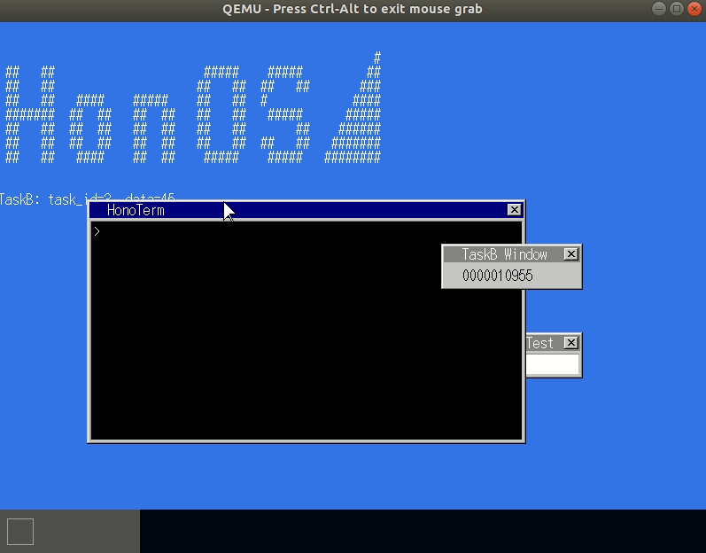

#### osbook_day16c

- `clear コマンド` を実装しました！


#### osbook_day16d

- `lspci コマンド` を実装しました！


#### osbook_day16e

- 上矢印/下矢印でコマンドの履歴を遡れるようになりました！


#### osbook_day16f

- CPU のリソースを食いまくっている TaskB のウィンドウを削除しました。以下の top コマンドの差を見ると、削除した結果 QEMU が使用しているリソースが減っていることがわかると思います。

- TaskB を削除する前の top コマンドの結果です。


- TaskB を削除した後の top コマンドの結果です。


- TaskB を削除しただけなので、特に変化はありません！


### 2021 年 9 月 14 日

#### osbook_day17a

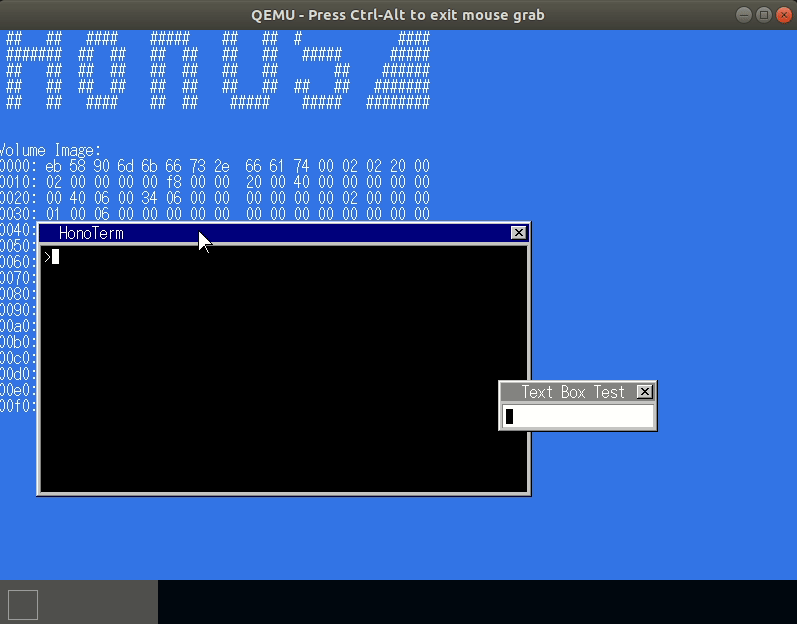


### 2021 年 9 月 15 日

#### osbook_day17b


### 2021 年 9 月 16 日

#### osbook_day18a


#### osbook_day18b

- 初めてアプリケーションを自作 OS 上で動作させた。ターミナルに `onlyhlt` コマンドを実行すると、ターミナルのプロセスが止まる。この節で OS とアプリケーションを全てビルドし、OS からアプリケーションを実行できるようなシェルスクリプトを実装した。

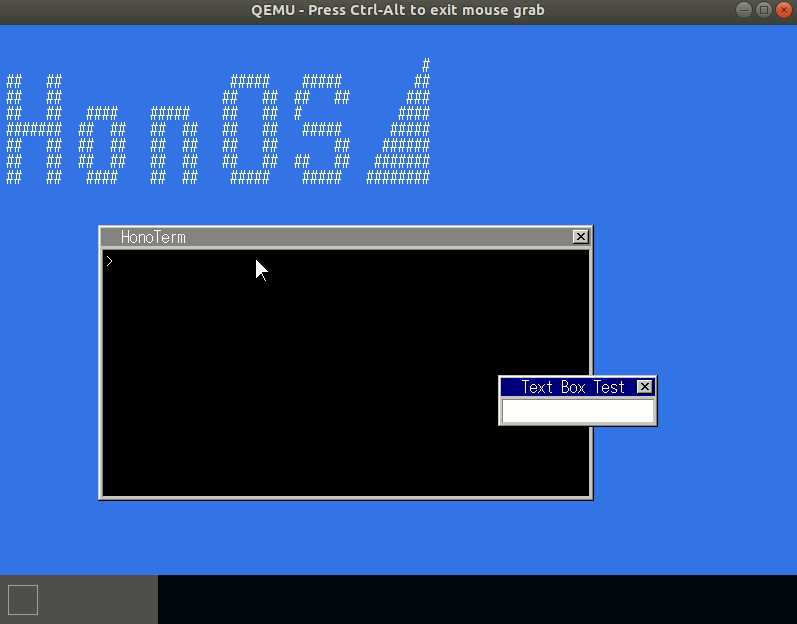


### 2021 年 9 月 17 日

#### osbook_day18c

- この節では簡単な算術演算のコマンド `rpn` コマンドを追加で実装した。実装後、OS を起動させると、`rpn` コマンドが実行できない。また、`ls` コマンドも実行できないことにも気づいた。そのため、このバグをトラブルシューティングする必要があった。そこで、まずこの節で追加で実装した機能にバグが無いかを調査した。そして次に、そこにバグが無いことを確認した。これは、`git bisect` のようなやり方でどのタイミングで `ls` コマンドが正常な起動をしなくなったかを調査した。結論としては、アプリケーションを起動させる際に新たに使用するようになった `~/osbook/devenv/make_mikanos_image.sh` の中身の環境変数のパスを自分の OS 用に変更していなかったことが問題だった。変更点は以下である。書籍でも少し触れてくれても良いのではないかと思った。

```bash
---
# LOADER_EFI="$HOME/edk2/Build/MikanLoaderX64/DEBUG_CLANG38/X64/Loader.efi"
# KERNEL_ELF="$MIKANOS_DIR/kernel/kernel.elf"
+++
LOADER_EFI=$HOME/edk2/Build/HonoLoaderX64/DEBUG_CLANG38/X64/Loader.efi
KERNEL_ELF=$HOME/honOS/kernel/kernel.elf
```

- こういったバグをできるだけ素早く気づき、どのケースでバグが発生しているかを確認するためにも、やはりテストコードを書くことは極めて重要だと痛感した。

- また、この節で初めて気づいたのだが、日本語配列のキーボードで `+` を入力すると、`:` が出力されてしまう。色々なキーボードを押して確認していると、`+` を出力するためには、`shift + ^` を押さなければならない。

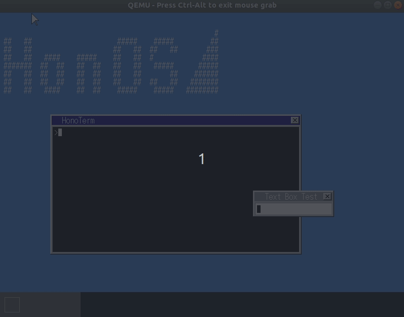

#### osbook_day18d

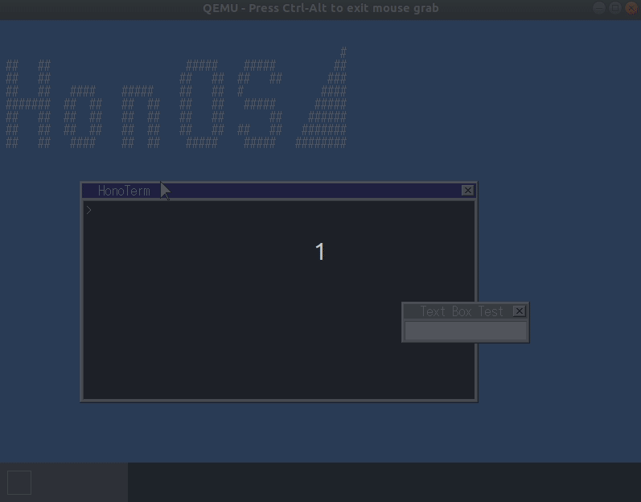


### 2021 年 9 月 18 日

#### osbook_day19a

- この章の仮想アドレスと物理アドレスの変換のロジックの実装が難しすぎて泣いた。


### 2021 年 9 月 19 日

#### osbook_day20a

- アプリケーション (rpn) から Kernel の関数 (printk など) を呼び出しました。

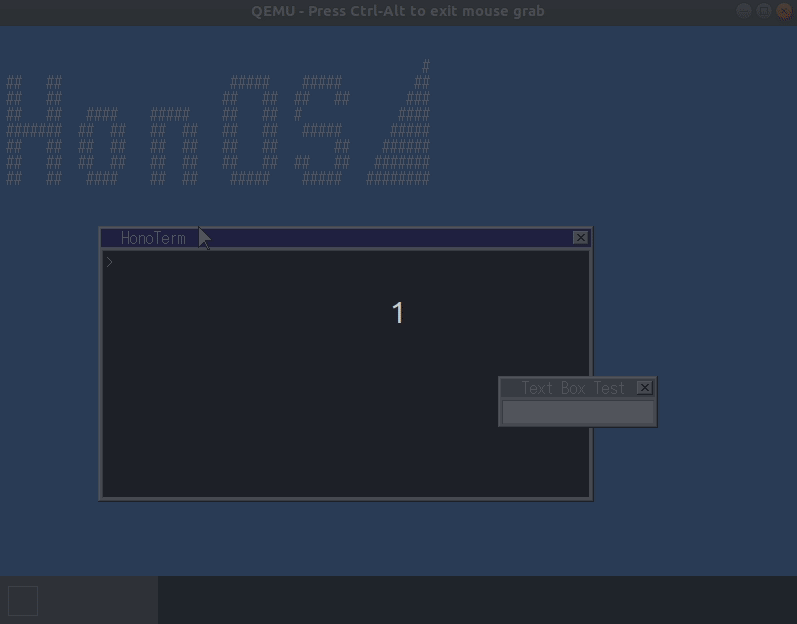


### 2021 年 9 月 20 日

#### osbook_day20b


#### osbook_day20c

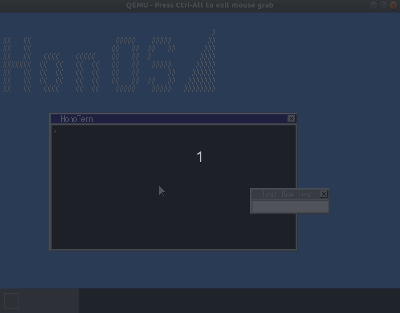

#### osbook_day20d

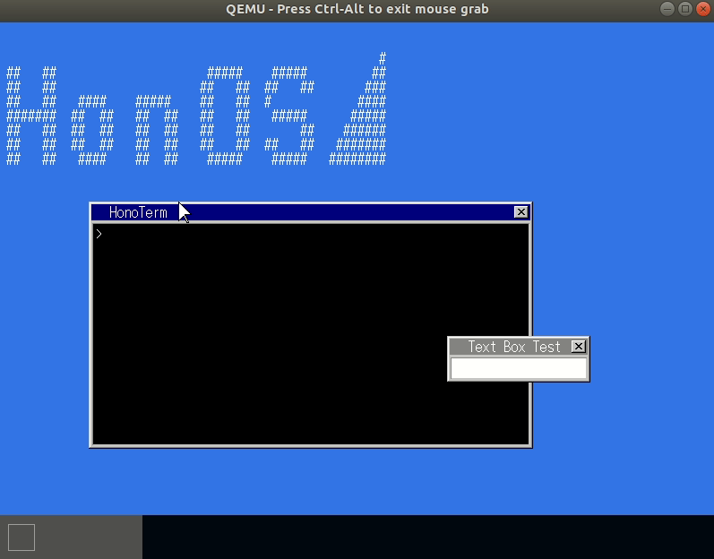


### 2021 年 9 月 24 日

#### osbook_day20e

- やっとシステムコールを実装できました。感激です。ここまで来るとシステムプログラミングを下側の Kernel から見上げれます。

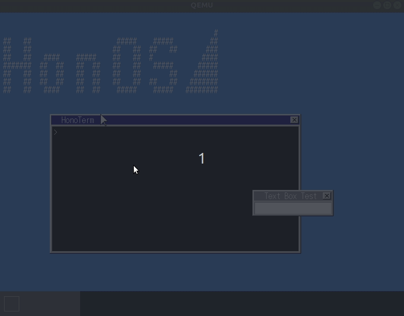

## 参考

- [honOS](https://github.com/dilmnqvovpnmlib/honOS)
- [mikanos](https://github.com/uchan-nos/mikanos)
